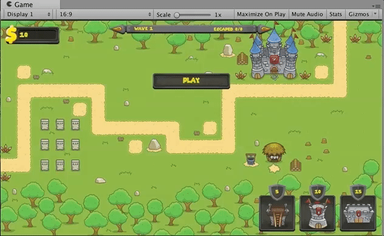
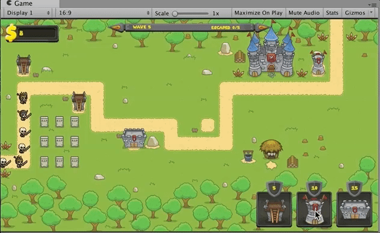
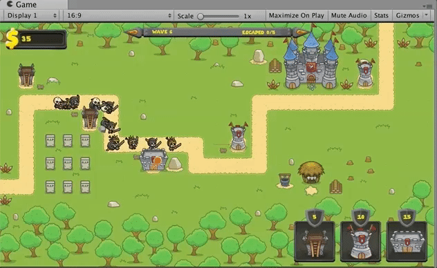

# Tower Defense Project   

A simple 2D tower defense game. Consists of 3 enemy types and 3 towers that shoot different projectiles.
Only a single level or scene was created but the main parts are in place (scripts and gamemanager and animations), would only have to move  
checkpoints and ground tiles around to create new levels.  

## C# Scripts:  
[Assets/Scripts](https://github.com/Brandon9721/Unity-Practice/tree/master/TowerDefenseProject/TowerDefense/Assets/Scripts)  

## Gifs:  

  

  

